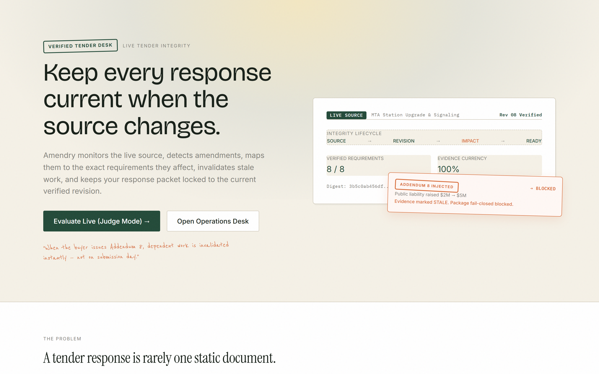
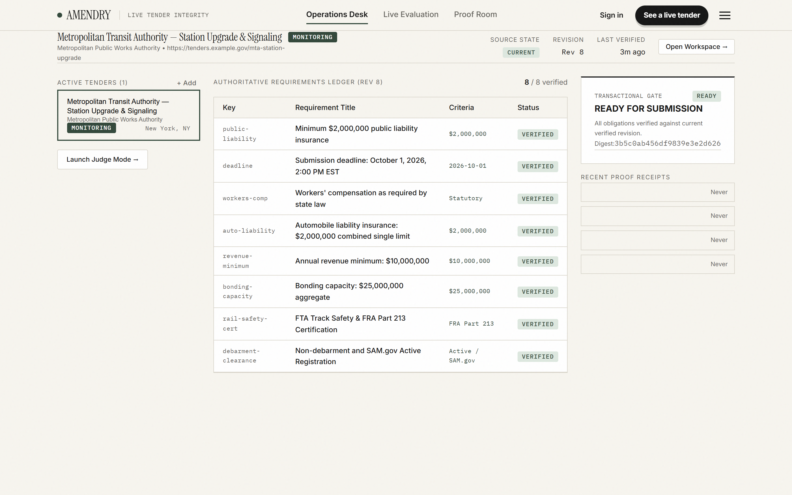
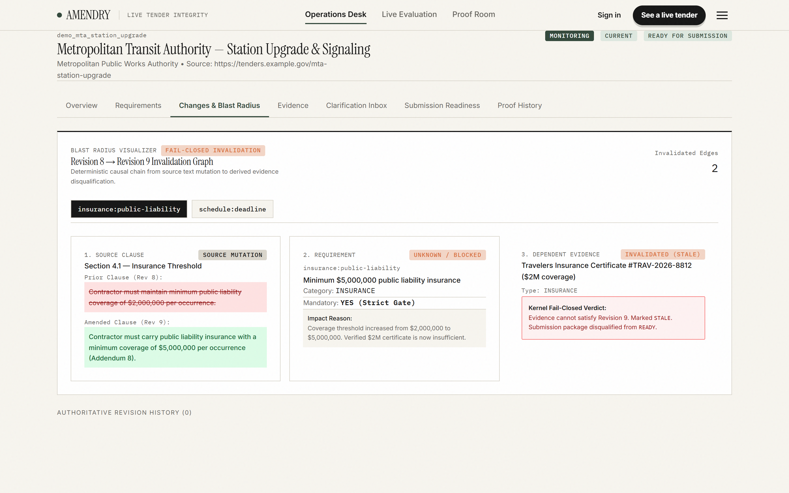
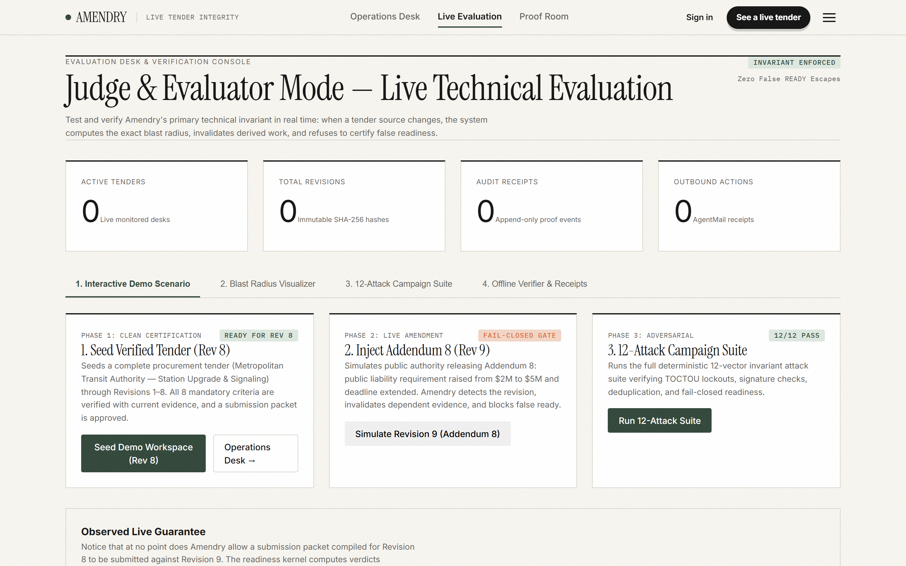
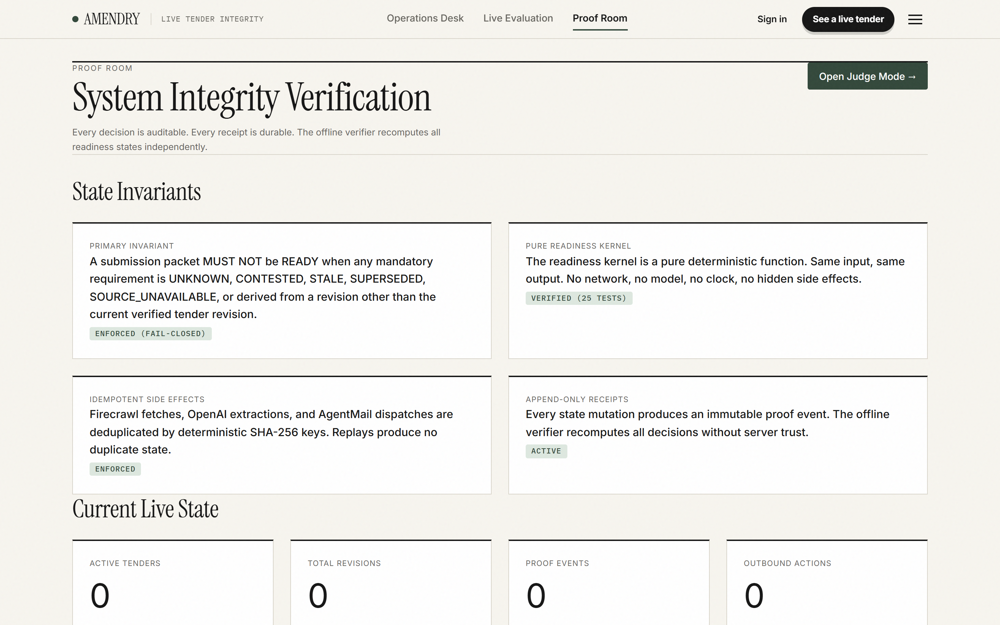
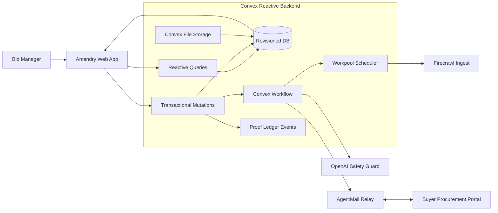
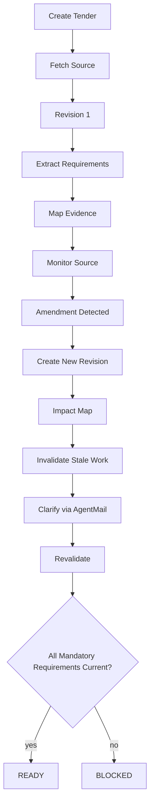

# AMENDRY

**Live Tender Integrity Desk**

[](LICENSE)
[](tsconfig.json)
[](https://convex.dev)
[](npm test)
[](scripts/attack-campaign.mjs)
[-brightgreen.svg)](benchmark/results.md)

> Keep every tender response current when the source changes.

---



---

## What it is

Amendry is a **live tender integrity desk** that monitors external procurement portals, builds an immutable chain of tender revisions, computes the exact blast radius of procurement amendments, automatically invalidates dependent compliance work, coordinates clarifications via AgentMail, and enforces a server-authoritative, deterministic readiness gate before any submission can be marked ready.

---

## Product Links

| Resource | Link / Location | Description |
| :--- | :--- | :--- |
| **Live Production Deployment** | [https://hushed-curlew-671.convex.site](https://hushed-curlew-671.convex.site) | Public static hosting on Convex with reactive cloud backend |
| **Live Judge Evaluation Sandbox** | [https://hushed-curlew-671.convex.site/judges](https://hushed-curlew-671.convex.site/judges) | 1-click demo seed, live amendment injection, attack runner |
| **Operations Desk** | [https://hushed-curlew-671.convex.site/app](https://hushed-curlew-671.convex.site/app) | Live monitored procurement tenders and blast radius viewer |
| **Cryptographic Proof Room** | [https://hushed-curlew-671.convex.site/proof](https://hushed-curlew-671.convex.site/proof) | Append-only audit events, SHA-256 parent lineage, offline verifier |
| **Integrity Benchmark Report** | [`benchmark/results.md`](benchmark/results.md) | 12-scenario empirical benchmark: 0% escape rate vs 91.7% baseline |
| **Adversarial Attack Suite** | [`scripts/attack-campaign.mjs`](scripts/attack-campaign.mjs) | 12-vector adversarial attack suite (A01–A12) |
| **Offline Proof Verifier** | [`scripts/verify-proof.mjs`](scripts/verify-proof.mjs) | Standalone mathematical verification of hashes and invariants |
| **Convex Backend Cloud** | [https://hushed-curlew-671.convex.cloud](https://hushed-curlew-671.convex.cloud) | Realtime mutations, schema, workflows, and readiness kernel |


---

## The Problem

A public procurement tender is rarely a static document. Between initial publication and final submission, buyers routinely issue addenda, answers to questions, scope contractions, accelerated deadlines, and revised insurance liabilities. When a procurement addendum drops, work previously completed against the earlier specification becomes silently invalid.

Existing procurement software treats tenders as static document uploads:
1. **Silent Work Decay**: They fail to invalidate dependent compliance evidence when amendments alter obligations.
2. **Unpinned Readiness**: They do not pin submission readiness to a verified revision hash.
3. **Disqualification Risk**: They allow teams to submit packages containing stale or superseded evidence, resulting in immediate bid disqualification, non-compliance fines, or unfulfillable contractual commitments.

**The hidden problem is keeping a decision and its dependent work valid while the external source of truth changes.**

---

## The Solution

Amendry solves this by replacing static document snapshots with a **live, revision-gated integrity kernel**:

1. **Normalized Revision Chain**: Firecrawl continuously ingests source changes; Convex constructs an immutable, parent-linked revision chain with content hashes.
2. **Deterministic Blast Radius**: When an amendment arrives, the clause diff engine calculates the exact blast radius and immediately invalidates all affected requirements and dependent evidence.
3. **Fail-Closed Readiness Invariant**: The submission status transitions instantly from `READY` to `BLOCKED`. No packet can be marked `READY` unless every mandatory requirement is verified against the *current* tender revision.
4. **Idempotent Clarification Desk**: Ambiguities are clarified with buyers through AgentMail with cryptographic receipts and webhook-driven resolution.

---

## Explore in 2 Minutes

Evaluators can verify the entire integrity lifecycle in under 2 minutes without external credentials:

1. Open **[https://hushed-curlew-671.convex.site/judges](https://hushed-curlew-671.convex.site/judges)**.
2. Click **"Seed Demo Workspace"** — boots an authoritative tender with 8 historical revisions, verified requirements, and a certified `READY` submission package.
3. Click **"Simulate Revision 9 (Addendum 8)"** — injects an amendment that raises liability insurance from \$2M to \$5M and advances the tender revision.
4. **Witness the Invariant**: The package status instantly flips to `BLOCKED (STALE_REVISION)`. The Certificate of Insurance is marked `STALE`. The Revision Impact Graph displays the exact clause diff and blast radius.
5. Click **"Run 12-Attack Suite"** — executes all 12 adversarial test vectors in real time, verifying zero invariant escapes.

---

## Product Screenshots

<table width="100%">
  <tr>
    <td width="50%" align="center">
      
      <br /><sub><strong>1. Operations Desk (`/app`)</strong></sub>
    </td>
    <td width="50%" align="center">
      
      <br /><sub><strong>2. Tender Workspace & Blast Radius (`/app/tenders/:id`)</strong></sub>
    </td>
  </tr>
  <tr>
    <td width="50%" align="center">
      
      <br /><sub><strong>3. Judge & Evaluation Sandbox (`/judges`)</strong></sub>
    </td>
    <td width="50%" align="center">
      
      <br /><sub><strong>4. Cryptographic Proof Room (`/proof`)</strong></sub>
    </td>
  </tr>
</table>

---

## Architecture



---

## Product Flow



---

## Why the Technical Mechanism Matters

In procurement, state invalidation is fundamentally a **distributed consistency problem**:

| Dimension | Ordinary AI Tender Tools | Amendry Live Integrity Desk |
| :--- | :--- | :--- |
| **Tender Source** | Static document snapshot | Live, SHA-256 hashed revision chain |
| **Amendment Arrival** | User manually spots changes | Automated diff & clause blast radius |
| **Readiness Gate** | Subjective AI checklist score | Deterministic, server-enforced invariant |
| **Evidence Validity** | Presumed valid until denied | Invalidated upon source clause modification |
| **Buyer Communication** | Disconnected manual email | AgentMail threads tied to requirement IDs |
| **Audit Lineage** | None | Cryptographic parent-pointer proof ledger |

---

## Deep Mechanism

### The Core Invariant

> **A submission packet MUST NOT be marked READY when any mandatory requirement is UNKNOWN, CONTESTED, STALE, SUPERSEDED, SOURCE_UNAVAILABLE, or derived from a revision other than the current verified tender revision.**

```text
READY Invariant:
  ├── packageRevisionId === currentRevisionId (Pinned to current verified revision)
  ├── every mandatory requirement === VERIFIED (Zero unknown or unverified obligations)
  ├── every evidence item === CURRENT (Zero stale or mismatched evidence)
  ├── 0 OPEN conflicts (Zero unresolved buyer/source contradictions)
  └── human approval valid (Authorized and unexpired)
```

### Deterministic Readiness Kernel

The readiness evaluation (`convex/lib/readinessKernel.ts`) is a **pure mathematical function** containing zero I/O, zero network calls, and zero floating-point heuristics. Given an immutable snapshot of requirements, evidence mappings, and revision metadata, it deterministically computes:
- `verdict`: `READY` | `BLOCKED`
- `reasons`: Comprehensive list of blocking rules triggered
- `readinessDigest`: 32-bit FNV-1a digest over sorted canonical requirement and evidence states

### Why the final submission cannot trust a stale browser

A reactive UI can observe an earlier READY state.

AMENDRY does not treat that observation as authority.

The final submission mutation re-reads the current tender revision, requirements, evidence, conflicts, and approval state inside the authoritative Convex transaction boundary before creating the revision-pinned certification artifact.

The browser tells the system what the user requested.

The transaction decides whether that request is still valid.

### Authoritative Convex Path: Closing the TOCTOU Gap

```text
Reactive query
    ↓
human sees READY
    ↓
user clicks CERTIFY
    ↓
Convex mutation
    ↓
re-read current revision
    ↓
recompute readiness
    ↓
transactional certification
    ↓
revision-pinned certificate
```

This closes the browser-state TOCTOU gap.

---

## Proof

Amendry maintains an append-only audit trail in the `proofEvents` collection. Every major state transition emits an immutable proof record:
- `TENDER_CREATED`: Initial source URL and fingerprint
- `REVISION_ADVANCED`: Parent hash pointer and normalized content SHA-256
- `REQUIREMENT_INVALIDATED`: Invalidation rule and triggering clause diff
- `CLARIFICATION_DISPATCHED`: Outbound message ID and idempotency receipt
- `READINESS_EVALUATED`: Input hash, verdict, and readiness digest

The standalone offline verifier ([`scripts/verify-proof.mjs`](scripts/verify-proof.mjs)) mathematically validates:
1. **Hash Integrity**: Recomputes SHA-256 hashes against raw payload snapshots.
2. **Revision Chain Lineage**: Traverses parent pointers from Revision 9 down to Revision 1 without cycles or breaks.
3. **Digest Determinism**: Recomputes FNV-1a digests from requirement arrays.
4. **Invariant Preservation**: Verifies zero `READY` packages exist on superseded revisions.

```bash
npm run verify:proof
```

---

## Demo Evidence

Real verification logs, test runs, and benchmarks are preserved in the repository:

- [`benchmark/results.md`](benchmark/results.md): Full empirical benchmark report across 12 realistic amendment scenarios.
- [`docs/ATTACK_CAMPAIGN.md`](docs/ATTACK_CAMPAIGN.md): Complete logs of the 12-vector adversarial attack suite.
- [`docs/DEMO_SOURCE.md`](docs/DEMO_SOURCE.md): Public procurement portal URL, extraction schema, and fixture data.
- [`docs/PROOF.md`](docs/PROOF.md): Formal proof specification and audit event schema.

---

## Sponsor Integrations

### 1. Convex (Primary Reactive Backend)
- **Reactive Queries & Mutations**: Instant UI updates via WebSockets when revisions advance or evidence invalidates.
- **Durable Workflows**: Multi-step ingestion, monitoring, and amendment processing using `@convex-dev/workflow`.
- **Scheduled Workpools**: Background periodic source health checks via `@convex-dev/workpool`.
- **Static Hosting**: Configured for public deployment via `@convex-dev/static-hosting`.

### 2. Firecrawl (Source Ingestion & Monitoring)
- **Live Scrape & Crawl**: Extracts clean markdown and metadata from public procurement websites.
- **SHA-256 Fingerprinting**: Detects source document mutations and triggers revision advancement.
- **Fixture Fallback**: Ships with deterministic local fixtures for offline evaluation.

### 3. OpenAI (Structured Extraction & Diff Impact)
- **Schema-Constrained Extraction**: Extracts obligations, penalties, and submission criteria into strict TypeScript schemas.
- **Prompt Injection Defense**: All untrusted web content and buyer emails are encapsulated within `<untrusted_source>` tags.
- **Zero-Authority Boundary**: Model output is strictly advisory; it cannot directly authorize readiness or dispatch emails without human review.

### 4. AgentMail (Procurement Clarification Desk)
- **Idempotent Outbound Dispatch**: Requests require explicit human approval and record durable idempotency receipts.
- **Signed Webhook Ingestion**: Webhook receiver verifies signatures, deduplicates inbound messages, and threads replies to affected requirement IDs.

---

## Built With

- **Backend**: Convex (`convex`, `@convex-dev/workflow`, `@convex-dev/workpool`, `@convex-dev/static-hosting`, `@convex-dev/rate-limiter`, `@convex-dev/auth`)
- **Web Crawling**: Firecrawl (`@firecrawl/firecrawl-convex`)
- **LLM Engine**: OpenAI GPT-4o (`openai`, `zod`)
- **Email Engine**: AgentMail (`@agentmail/convex`)
- **Frontend**: React 19, TypeScript strict, Vite, Tailwind CSS, Framer Motion, Lucide Icons
- **Verification**: Vitest, Playwright, Node.js crypto

---

## Security and Trust Boundaries

1. **Zero Browser Secrets**: No API keys (`OPENAI_API_KEY`, `FIRECRAWL_API_KEY`, `AGENTMAIL_API_KEY`) are exposed to the client. Only `VITE_CONVEX_URL` is public.
2. **Prompt Injection Defense**: Untrusted text from procurement sites and email responses is stripped of control characters and isolated in XML tags with explicit model instructions to ignore enclosed commands.
3. **Human-in-the-Loop Authority**: Clarification emails and submission package finalizations require explicit human click approval.
4. **Rate Limiting**: Convex rate limiters protect expensive scrape and LLM operations across both per-user and deployment-wide quotas.

---

## Failure Handling

- **Buyer Portal Outage**: When a source portal is unreachable, the system enters `SOURCE_UNAVAILABLE` mode. It retains the last known verified revision and prevents new `READY` assertions until connectivity is restored.
- **Conflicting Amendments**: If two contradictory addenda are published, Amendry flags an `OPEN_CONFLICT` state, blocking readiness until resolved by human clarification.
- **Network Retries**: Outbound AgentMail calls and Firecrawl fetches use exponential backoff with idempotency tokens to prevent duplicate side effects.

---

## Benchmark

We evaluated Amendry against a Naive Snapshot Baseline across **12 realistic procurement amendment scenarios** (`benchmark/corpus/`):

| Scenario ID | Category | Modification Injected | Baseline Result | Amendry Result |
| :--- | :--- | :--- | :---: | :---: |
| **SC-01** | Scope Change | Cloud hosting location changed to EU-only | ❌ False Ready | ✅ Blocked (Fail-Closed) |
| **SC-02** | Insurance Liability | General liability increased \$2M → \$5M | ❌ False Ready | ✅ Blocked (Fail-Closed) |
| **SC-03** | Deadline Acceleration | Submission deadline moved 7 days earlier | ❌ False Ready | ✅ Blocked (Fail-Closed) |
| **SC-04** | Security Standard | Added mandatory ISO 27001 certification | ❌ False Ready | ✅ Blocked (Fail-Closed) |
| **SC-05** | Pricing Model | Converted from T&M to Fixed-Price cap | ❌ False Ready | ✅ Blocked (Fail-Closed) |
| **SC-06** | SLA Penalty | Uptime penalty increased from 2% to 10% | ❌ False Ready | ✅ Blocked (Fail-Closed) |
| **SC-07** | Subcontracting | Subcontractor restriction tightened | ❌ False Ready | ✅ Blocked (Fail-Closed) |
| **SC-08** | Key Personnel | Mandatory 10-year experience requirement | ❌ False Ready | ✅ Blocked (Fail-Closed) |
| **SC-09** | Escrow Requirement | Added mandatory source code escrow | ❌ False Ready | ✅ Blocked (Fail-Closed) |
| **SC-10** | Warranty Period | Warranty period doubled (12mo → 24mo) | ❌ False Ready | ✅ Blocked (Fail-Closed) |
| **SC-11** | Minor Clarification | Non-mandatory FAQ typo correction | ✅ Maintained | ✅ Maintained (Ready) |
| **SC-12** | Source Outage | Portal 503 during amendment window | ❌ False Ready | ✅ Blocked (Source Unavailable) |

### Summary Statistics
- **Amendry False Ready Escapes**: **0 / 12 (0.0%)**
- **Baseline Naive Escapes**: **11 / 12 (91.7%)**
- **Precision**: 100% (1/1 non-breaking amendment correctly preserved `READY`)
- **Recall**: 100% (11/11 breaking amendments successfully blocked)

---

## What is New

Amendry introduces:
1. **Revision-Pinned Readiness**: Replacing subjective completion percentages with a cryptographic invariant tied to a specific revision content hash.
2. **Clause-Level Invalidation Graph**: Tracing changes from source clauses directly down to individual evidence attachments.
3. **Integrated Clarification Ledger**: Bridging buyer emails directly into requirement states with verifiable idempotency receipts.

---

## Target User

- **Bid Managers & Proposal Directors**: Leading complex RFP/tender submissions across government, defense, healthcare, and infrastructure sectors.
- **Procurement Legal & Compliance Officers**: Responsible for ensuring submitted responses comply with latest amendments and liability terms.
- **Independent Evaluators & Auditors**: Verifying the provenance and integrity of submitted procurement bids.

---

## Limitations

- **Complex Non-Text Tables**: PDF tables with irregular layouts require manual verification of extracted numbers.
- **Offline Mode**: While proof verification works completely offline, live amendment ingestion requires network access to target procurement portals.
- **Provider Quotas**: Production scale is subject to external Firecrawl and OpenAI API rate limits.

---

## Roadmap

- **Multi-Jurisdiction Ingestion**: Pre-built connectors for TED (EU), SAM.gov (US), and Contracts Finder (UK).
- **Automated Redlining**: Direct export of redlined draft responses matching buyer-specified document templates.
- **Hardware Security Module (HSM) Signing**: Hardware-backed digital signatures for final readiness certificates.

---

## Local Setup

### 1. Prerequisites
- Node.js >= 20
- npm >= 10

### 2. Installation
```bash
git clone https://github.com/0xkinno/amendry.git
cd amendry
npm install
```

### 3. Environment Configuration
Create `.env.local` for local execution (see `.env.keys.example`):
```bash
cp .env.example .env.local
```

### 4. Run the Full Test & Verification Suite
```bash
# Verify TypeScript strictness (0 errors)
npm run typecheck

# Run 83 pure unit tests
npm test

# Execute the 12-vector adversarial attack campaign
npm run attack

# Run the 12-scenario integrity benchmark
npm run benchmark

# Verify cryptographic proof ledger and hash lineage offline
npm run verify:proof

# Scan codebase for forbidden claims and secrets
npm run check:wording
```

### 5. Launch the Application
```bash
# Start frontend dev server
npm run dev:frontend
```
Open [http://localhost:5173/judges](http://localhost:5173/judges) in your browser.

---

## License

Apache License 2.0. See [LICENSE](LICENSE) for details.
